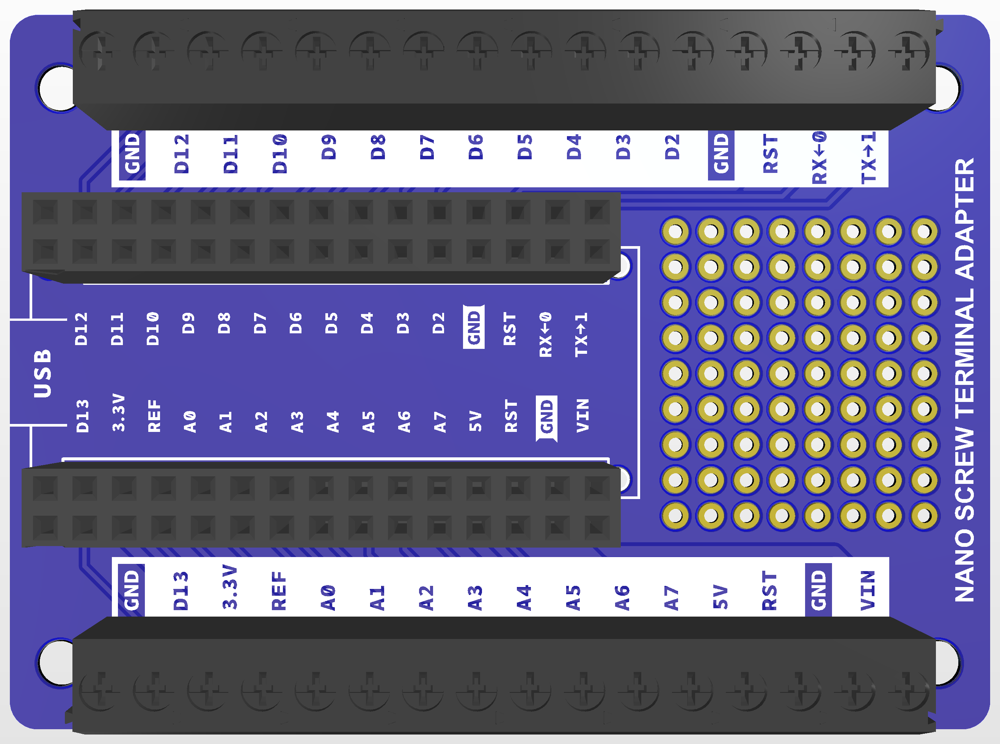
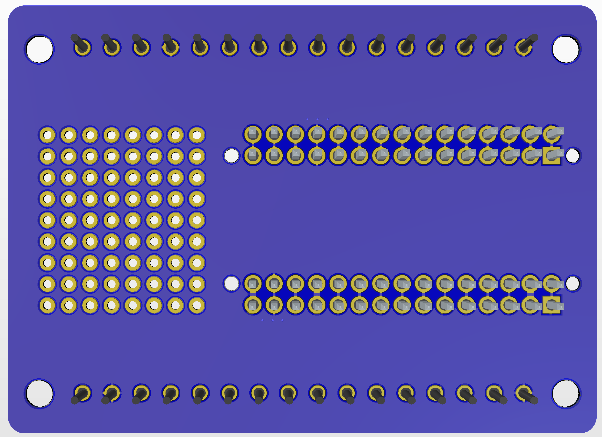

# Nano Terminal breakout   

### Description
This board is a quick and dirty remix of the original Arduino 
Nano Screw Terminal Adapter. 
The main difference between this version and the original is the replacement of the SMD double-row female header with a through Hole female header. 
This change gives the possibility to solder the Nano board directly to the screw terminal breakout or use a female header that is more common and easier to solder.
 
The technical documentation of the original design can be found [here](https://docs.arduino.cc/hardware/nano-screw-terminal-adapter/).

### Compatible boards
This breakout is compatible with all the boards in the Nano family. 
I tested this version on the following boards:
- Arduino Nano 
- Arduino Nano Every 
- Arduino Nano BLE 

### Components 
I used the following components:
| # | Description | Qty | Link |
|:---:|---|:---:|---|
| 1 | 30 Position Header Connector 2.54mm Through Hole | 2 | [Link](https://www.digikey.com/short/5cw1vd80) |
| 2 | 2 positions 3.5mm Pitch Screw Terminal Block Connector | 16 | [Link](https://www.aliexpress.com/item/1005002855835327.html?spm=a2g0o.order_detail.order_detail_item.3.6e3ff19ctAkFpz) |

### Pictures
#### Top side 

#### Bottom side
